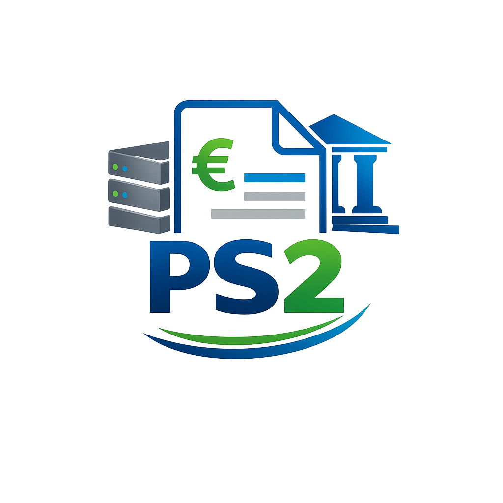

<p align="center">
  
</p>

# Análise de arquivos PS2
**Licenciatura em Engenharia de Sistemas Informáticos** (Pós-Laboral) 2025-26 Escola Superior de Tecnologia - IPCA

---
## Descrição do Projeto
PS2 é um formato bancário estruturado usado para débitos diretos, composto por registos padronizados que garantem a validação, integridade e processamento automático das transações financeiras.
O principal objetivo desse projeto é gerarmos esse tipo de arquivo através de dados guardados em ficheiros e depois analisarmos os dados em uma Dashboard.

Para a realização e cumprimento dos objetivos foram utilizadas as seguintes linguagens de programção:
* **C**: Ler ficheiros e gerar o arquivo PS2 estruturado.
* **Python**: Validação e manipulação de dados e visualização de métricas.

## Documentação
A documentação foi feita com a biblioteca externa Doxygen e Doxywizard.

## Organização do Repositório
A estrutura do projeto segue as boas práticas de modularização exigidas:

| Diretoria | Descrição |
| :--- | :--- |
| **[`data/`](./data/)** | Contém os ficheiros de entrada  para testes e processamento. |
| **[`doc/`](./doc/)** | Documentação académica, incluindo o relatório final em LaTeX. |
| **[`ref/`](./ref/)** | Documentação técnica gerada automaticamente via Doxygen (HTML/PDF). |
| **[`src/`](./src/)** | Código-fonte da aplicação (`app.py`, `cli.py`, `parser.py`, etc.). |

## Como Executar
### **Pré-requisitos:**
Antes de executar o programa via CLI ou shiny é necessário a criação de uma venv e a instalação das bibliotecas usada no projeto. Para instalar e rodar tudo corretamente e necessário estar na pasta raiz do projeto.

### Venv e Bibliotecas:
```
make venv
make install
```

### CLI:
```
make cli
```

### Shiny:
```
make shiny
```
